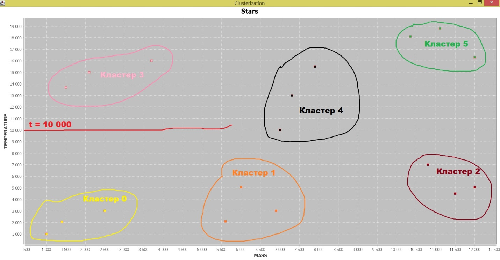

# kmeans
 
Realization of clustering algorithm "kmeans" on Java

<h2>Содержание</h2>
<ul>
	<li>Цель работы</li>
	<li>Теоретическое введение</li>
	<li>Ход работы</li>
	<ul><li>Тестирование</li></ul>
	<li>Вывод</li>
	<li>Список используемой литературы</li>
</ul>

<h2>Цель работы</h2>

Реализовать кластеризацию методами <b>k-means</b> и <b>fuzzy c-means</b>. Набор данных выбирается самостоятельно. Возможен выбор популярного датасета “Ирисы Фишера”.

<h2>Теоретическое введение</h2>

<b>[4]</b> С развитием сети Интернет получили развитие вопросы построения распределенных баз данных, создания распределенных глобальных информационных систем. Многократно возросла интенсивность формирования и архивирования различных данных, за которыми следовало развитие масштабируемых программно-аппаратных комплексов, дорогостоящих мощных и недорогих пользовательских компьютеров и накопителей данных.

Все это способствовало всплеску развития индустрии ИКТ и сделало огромное количество баз данных доступными для хранения разнородной информации в значительных объемах и управления транзакциями в них. При этом все больше возникала <b>потребность анализа имеющихся данных</b> в разновременном аспекте, с возможностью построения произвольных запросов, при условии обработки сверхбольших объемов данных, полученных, в том числе, из различных регистрирующих БД. Использование для этих задач традиционных регистрирующих систем и БД крайне затруднительно. Например, в регистрирующей системе информация актуальна исключительно на момент обращения к БД, а в следующий момент времени по тому же запросу можно ожидать другой результат. Интерфейс таких систем рассчитан на проведение определенных стандартизованных операций и возможности получения результатов на нерегламентированный произвольный запрос ограничены. Возможности обработки больших массивов данных также могут быть ограничены вследствие ориентации СУБД на нормализованные данные, характерные для стандартных реляционных регистрирующих БД.

Ответом на возникшую потребность стало появление новой технологии организации баз данных — технологии <b>Хранилищ Данных</b> (англ. «Data Warehouse»), предполагающей некоторую предварительную обработку данных и их интеграцию, а также онлайновую аналитическую обработку (англ. «On-Line Analytical Processing», OLAP).

Несмотря на очевидную пользу такого инструмента анализа данных, он ориентирован на хорошо нормализованные табличные данные и не предполагает использование целого ряда дополнительного аналитического инструментария типа классификации, кластеризации, регрессионного анализа, моделирования, прогнозирования и интерпретации многомерных данных и т.п.

Таким образом, сегодня наблюдается высокий уровень развития масштабируемой аппаратно-программной ИКТ инфраструктуры, позволяющей увеличивать и без того значительные архивы данных. Имеется достаточно существенный задел в области компьютерных наук и информационных технологий, разработаны теория и прикладные аспекты теории вероятности и математической статистики. Однако при этом следует признать, что присутствует заметный избыток данных при дефиците информации и знаний. Быстро растущие объемы накопленных и пополняемых (автоматически, а не людьми — как это было когда-то) архивов данных пока существенно превышают способности человека в их практически полезной обработке. Для обострения этого тезиса иногда говорят, что «большие базы данных стали могилами, которые редко посещаются». Как следствие, важные решения порой принимаются не на основе аналитических выводов из информативных БД, а на основе интуиции человека, не имеющего подходящих инструментов для извлечения полезных знаний из имеющихся огромных объемов данных.

Поэтому в последние годы стремительное развитие получила область <b>Data Mining</b> (в отечественной литературе наиболее используемая аналогия — интеллектуальный анализ Данных, ИАД), направленная на поиск и разработку методов извлечения из имеющихся данных знаний, позволяющих принимать на их основе конкретные, в высокой степени обоснованные, практически полезные управленческие решения <b>[4]</b>.

<h2>Ход работы</h2>

Для написания кода была использована IDE IntelliJ IDEA. Язык программирования был выбран Java. Помимо стандартных Java-библиотек, использовалась также библиотека для построения графиков и диаграмм <i>«JFreeChart»</i> автора <i>Дэвида Гилберта</i> (David Gilbert; он же jfree) <b>[3]</b>.

Как указано, в презентации, которую сделали мои одногруппницы, есть строго определённые шаги при выполнении алгоритмов «k-means» и «fuzzy c-means» <b>[1,2]</b>. Их вы, дорогой читатель, должны придерживаться.

Структура кода как реализации первого из этих алгоритмов кластеризации содержит в себе три класса: <code>Main</code>, <code>KMeans</code> и <code>Universe</code> (от англ. «Вселенная»).

Группируются в этой работе звёзды в шесть заранее выбранных <i>кластеров</i> (т.е. групп) (см. рисунок 1). 

</img> Рисунок 1 — Исследуемая предметная область

Чем выше температура, тем у звезды цвет холоднее. И чем выше масса звезды, тем короче её жизненный цикл. Совсем массивные звёзды превращаются в нейтронные звёзды или чёрные дыры в конце своего существования.

Единицы обсуждаемых величин, хоть и показаны в килограммах и кельвинах (см. рисунок выше), но всё равно являются по большей части выдуманными и несоответствующими реальным значениям температуры и массы подобных светил. Но в целом, для этой работы сойдут и такие, очень-очень приближённые значения. Это сделано для удобства реализации кода.

Класс <code>Universe</code> описывает звёзды и используется в классе <code>KMeans</code> в процессе группировки (кластеризации). Класс <code>Main</code> по умолчанию начальная точка запуска всей программы. В <code>Main</code> рисуется также график при помощи модуля <code>JFreeChart</code>.

Начальная выборка звёзд задаётся в том же классе <code>Main</code> в самом начале (см. код 1 ниже).

<table align="center"><tr><td>

<code>public static void <b>main</b>(String[] args) {</code> 
<code>&nbsp;&nbsp;&nbsp;&nbsp;String[] <b>stars</b> = new String[18];</code> 
<code>&nbsp;&nbsp;&nbsp;&nbsp;stars[0] = "1000:1000.0;-1"; stars[1] = "2050:1400.0;-1"; stars[2] = "3000:2500.0;-1";</code> 
<code>&nbsp;&nbsp;&nbsp;&nbsp;stars[3] = "2100:5600.0;-1"; stars[4] = "5050:6000.0;-1"; stars[5] = "3000:6900.0;-1";</code> 
<code>&nbsp;&nbsp;&nbsp;&nbsp;stars[6] = "4500:11500.0;-1"; stars[7] = "5050:12000.0;-1"; stars[8] = "7000:10800.0;-1";</code> 
<code>&nbsp;&nbsp;&nbsp;&nbsp;stars[9] = "18100:10350.0;-1"; stars[10] = "18800:11110.0;-1"; stars[11] = "16300:12000.0;-1";</code> 
<code>&nbsp;&nbsp;&nbsp;&nbsp;stars[12] = "10000:7000.0;-1"; stars[13] = "13000:7300.0;-1"; stars[14] = "15500:7900.0;-1";</code> 
<code>&nbsp;&nbsp;&nbsp;&nbsp;stars[15] = "13700:1500.0;-1"; stars[16] = "15000:2100.0;-1"; stars[17] = "16000:3700.0;-1";</code> 
<code>}</code>

Код 1 — Выборка кластеризуемых объектов (звёзд)

</td></tr></table>

В классе <code>Universe</code> есть массив строк <code>stars</code>, который и содержит в подобном формате описание всех звёзд (объектов). Массив выше (см. код 1) передаётся в качестве аргумента в конструктор класса <code>Universe</code> при его создании, и тем самым инициализируются все объекты <code>Universe</code>, над которыми и будет проводиться работа.

Этот <code>Universe</code>, как было сказано чуть раньше, передаётся следом в конструктор уже <code>KMeans</code> — класс, который содержит в себе методы алгоритма кластеризации «k-means» [2,1]:

<code>KMeans kmeans = <b>new KMeans(new Universe(stars))</b>;</code>

Далее идёт вывод результатов в консоль и в окно модуля <code>JFreeChart</code>:

<table align="center"><tr><td>

<code>XYSeries series = new XYSeries("Universe");</code>  

<code>int[] temperatures = kmeans.sample.getTemp();</code> 
<code>float[] masses = kmeans.sample.getMass();</code>  

<code>System.out.println(kmeans.sample);</code>  

 <code><b>kmeans.run();</b></code>  

<code>System.out.println(kmeans.sample);</code>  

<code>for(int i = 0; i < kmeans.sample.count(); ++i) {</code> 
<code>&nbsp;&nbsp;&nbsp;&nbsp;series.add(masses[i], temperatures[i]);</code> 
<code>}</code>  

<code>XYDataset xyDataset = new XYSeriesCollection(series);</code>  

<code>JFreeChart chart = ChartFactory</code> 
<code>&nbsp;&nbsp;&nbsp;&nbsp;.createScatterPlot("Stars", "MASS", "TEMPERATURE",</code> 
<code>&nbsp;&nbsp;&nbsp;&nbsp;xyDataset,</code> 
<code>&nbsp;&nbsp;&nbsp;&nbsp;PlotOrientation.VERTICAL,</code> 
<code>&nbsp;&nbsp;&nbsp;&nbsp;true, true, true);</code>  

<code>JFrame frame =</code> 
<code>&nbsp;&nbsp;&nbsp;&nbsp;new JFrame("Clusterization");</code> 
<code>frame.getContentPane()</code> 
<code>&nbsp;&nbsp;&nbsp;&nbsp;.add(new ChartPanel(chart));</code>  

<code>frame.setSize(400,300);</code> 
<code>frame.show();</code>

Код 2 — Остальная часть метода <code>main()</code>

</td></tr></table>

Метод <code>run()</code>, как видно из кода 2 выше, принадлежит классу <code>KMeans</code> и выполняет основную часть алгоритма k-means. Переменная <code>sample</code> у объекта <code>kmeans</code> в том же коде выше и есть объект Вселенной, хранящий массив всех звёзд. А благодаря методам <code>getTemp()</code> и <code>getMass()</code> вытаскиваются из строк (см. код 1) соответственно температура и масса каждой звезды и возвращаются в виде массивов.

Чтобы вам было понятнее, дорогой читатель, нужно пояснить значение этих строк:

<code>stars[0] = <b>"1000:1000.0;-1"</b>; stars[1] = <b>"2050:1400.0;-1"</b>; stars[2] = <b>"3000:2500.0;-1"</b>;</code>

Число до двоеточия в них — это <i>температура</i>. Число с плавающей точкой после двоеточия обозначает значение <i>массы</i> соответствующей звезды; а цифра в конце означает принадлежность звезды к какому-либо кластеру. Кластеры нумеруются от 0-ля до 5-ти, а <i>-1</i> означает, что звезда пока что не принадлежит ни к какому кластеру.

Таким образом, заданная выборка объектов во Вселенной будет графически выглядеть так — см. рисунок 2.

Глазом из этого рисунка уже можно примерно выделить группы, небольшие скопления звёзд.

Класс <code>Universe</code> вбирает в себя весь код, необходимый для редактирования и чтения данных о его объектах. К примеру, публичный метод <code>changeCluster()</code> изменяет номер кластера какого-либо объекта, а метод <code>getStars()</code> выступает в роли геттера для переменной-массива класса <code>stars</code>.

Полный код этого класса представлен в этом каталоге ГитХаба! 

</img> Рисунок 2 — Начальный некластеризованный набор звёзд

Как и код класса <code>Universe</code>, <code>KMeans</code> с основной частью этой лабораторной работы тоже представлен в этом репозитории ГитХаба.

<h3>Тестирование</h3>

В итоге, из-за случайной компоненты при выборе начальных центров всех кластеров программа выдаёт несколько возможных вариантов группировки звёзд по шести кластерам.

Первый вариант представлен в блоке Код 3 ниже.

<table align="center"><tr><td>
<pre>
0.
	Temperature: 1000
	Mass: 1000.0
	<b>Cluster: 0</b>

1)
	Temperature: 2050
	Mass: 1400.0
	Cluster: -1

2)
	Temperature: 3000
	Mass: 2500.0
	Cluster: -1

3)
	Temperature: 2100
	Mass: 5600.0
	Cluster: -1

4)
	Temperature: 5050
	Mass: 6000.0
	Cluster: -1

5)
	Temperature: 3000
	Mass: 6900.0
	<b>Cluster: 1</b>

6)
	Temperature: 4500
	Mass: 11500.0
	Cluster: -1

7)
	Temperature: 5050
	Mass: 12000.0
	Cluster: -1

8)
	Temperature: 7000
	Mass: 10800.0
	Cluster: -1

9)
	Temperature: 18100
	Mass: 10350.0
	Cluster: -1

10)
	Temperature: 18800
	Mass: 11110.0
	<b>Cluster: 5</b>

11)
	Temperature: 16300
	Mass: 12000.0
	<b>Cluster: 5</b>

12)
	Temperature: 10000
	Mass: 7000.0
	Cluster: -1

13)
	Temperature: 13000
	Mass: 7300.0
	Cluster: -1

14)
	Temperature: 15500
	Mass: 7900.0
	Cluster: -1

15)
	Temperature: 13700
	Mass: 1500.0
	Cluster: -1

16)
	Temperature: 15000
	Mass: 2100.0
	<b>Cluster: 3</b>

17)
	Temperature: 16000
	Mass: 3700.0
	<b>Cluster: 3</b>

i = 0	( 1633.3333333333333 ; 2016.6666666666667 )	cluster: 0.0
i = 1	( 8800.0 ; 4450.0 )	cluster: 1.0
i = 3	( 4320.0 ; 13540.0 )	cluster: 3.0
i = 5	( 10340.0 ; 17175.0 )	cluster: 5.0
<b>v = 1.2798692222222222E8</b>
i = 0	( 2625.0 ; 2037.5 )	cluster: 0.0
i = 1	( 9440.0 ; 4920.0 )	cluster: 1.0
i = 3	( 4320.0 ; 13540.0 )	cluster: 3.0
i = 5	( 10340.0 ; 17175.0 )	cluster: 5.0
<b>v = 1.20899075E8</b>
i = 0	( 2625.0 ; 2037.5 )	cluster: 0.0
i = 1	( 9440.0 ; 4920.0 )	cluster: 1.0
i = 3	( 4320.0 ; 13540.0 )	cluster: 3.0
i = 5	( 10340.0 ; 17175.0 )	cluster: 5.0
<b>v = 1.20899075E8</b>

0.
	Temperature: 1000
	Mass: 1000.0
	Cluster: 0

1)
	Temperature: 2050
	Mass: 1400.0
	Cluster: 0

2)
	Temperature: 3000
	Mass: 2500.0
	Cluster: 0

3)
	Temperature: 2100
	Mass: 5600.0
	Cluster: 0

4)
	Temperature: 5050
	Mass: 6000.0
	Cluster: 1

5)
	Temperature: 3000
	Mass: 6900.0
	Cluster: 1

6)
	Temperature: 4500
	Mass: 11500.0
	Cluster: 1

7)
	Temperature: 5050
	Mass: 12000.0
	Cluster: 1

8)
	Temperature: 7000
	Mass: 10800.0
	Cluster: 1

9)
	Temperature: 18100
	Mass: 10350.0
	Cluster: 5

10)
	Temperature: 18800
	Mass: 11110.0
	Cluster: 5

11)
	Temperature: 16300
	Mass: 12000.0
	Cluster: 5

12)
	Temperature: 10000
	Mass: 7000.0
	Cluster: 3

13)
	Temperature: 13000
	Mass: 7300.0
	Cluster: 3

14)
	Temperature: 15500
	Mass: 7900.0
	Cluster: 5

15)
	Temperature: 13700
	Mass: 1500.0
	Cluster: 3

16)
	Temperature: 15000
	Mass: 2100.0
	Cluster: 3

17)
	Temperature: 16000
	Mass: 3700.0
	Cluster: 3
</pre>

Код 3 — Вывод программы в консоль

</td></tr></table>

Как видно из этого вывода, алгоритм решил обойтись вообще без двух кластеров (с номерами 2 и 4) и смог кластеризовать объекты и таким способом.

Способ группировки тут зависит от начального выбора центров кластеров, который, как уже упоминалось, имеет <i>случайную компоненту</i> — то есть алгоритм характеризуется чётко прослеживаемой <i>стохастичностью</i>.

Метод <code>init()</code> класса <code>KMeans</code> инициализирует алгоритм и определяет начальные центры всех групп. В нём используется класс <code>Random</code>, генерирующий псевдослучайные числа. См. код 4.

Расстояния (а р<i>а</i>вно различия) между объектами представлены Евклидовой метрикой:

</img>

Чем больше расстояние <b>d</b>, тем больше различие между двумя объектами (см. код 4, выделенное жирным).

<table align="center"><tr><td>

<code>private int[] init() {</code> 
<code>&nbsp;&nbsp;Random random = new Random();</code> 
<code>&nbsp;&nbsp;int[] centers = new int[CLUSTERS_NUM];</code> 
<code>&nbsp;&nbsp;Arrays.fill(centers, -2);</code> 
<code>&nbsp;&nbsp;int counter = 0;</code> 
<code>&nbsp;&nbsp;centers[counter++] = random.nextInt(sample.count()-1);</code> 

<code>&nbsp;&nbsp;int[] temperatures = sample.getTemp();</code><i>&nbsp;&nbsp;// массив температур звёзд</i> 
<code>&nbsp;&nbsp;float[] masses = sample.getMass();</code><i>&nbsp;&nbsp;// массив масс звёзд Вселенной</i> 
<code>&nbsp;&nbsp;int[] clusters = sample.getClusters();</code><i>&nbsp;&nbsp;// массив кластеров каждой звезды</i> 

<i>&nbsp;&nbsp;// Поэтапно определить все необходимые центроиды:</i> 
<code>&nbsp;&nbsp;while (counter < this.CLUSTERS_NUM) {</code> 
<code>&nbsp;&nbsp;&nbsp;&nbsp;double[] min_distances = new double[sample.count()];</code> 
<code>&nbsp;&nbsp;&nbsp;&nbsp;double[][] distances = new double[sample.count()][sample.count()];</code> 
<code>&nbsp;&nbsp;&nbsp;&nbsp;double sum = 0;</code> 
<code>&nbsp;&nbsp;&nbsp;&nbsp;for (int i = 0; i < temperatures.length; ++i) {</code> 
<code>&nbsp;&nbsp;&nbsp;&nbsp;&nbsp;&nbsp;double min = -1;</code> 
<code>&nbsp;&nbsp;&nbsp;&nbsp;&nbsp;&nbsp;for (int j = 0; j < counter; ++j) {</code> 
<b>&nbsp;&nbsp;&nbsp;&nbsp;&nbsp;&nbsp;&nbsp;&nbsp;distances[i][j] = (temperatures[centers[j]] - temperatures[i]) * (temperatures[centers[j]] - temperatures[i]) + (masses[centers[j]] - masses[i]) * (masses[centers[j]] - masses[i]);</b> 
<code>&nbsp;&nbsp;&nbsp;&nbsp;&nbsp;&nbsp;&nbsp;&nbsp;if (min == -1)</code> 
<code>&nbsp;&nbsp;&nbsp;&nbsp;&nbsp;&nbsp;&nbsp;&nbsp;&nbsp;&nbsp;min = distances[i][j];</code> 
<code>&nbsp;&nbsp;&nbsp;&nbsp;&nbsp;&nbsp;&nbsp;&nbsp;else if (min > distances[i][j])</code> 
<code>&nbsp;&nbsp;&nbsp;&nbsp;&nbsp;&nbsp;&nbsp;&nbsp;&nbsp;&nbsp;min = distances[i][j];</code>  

<code>&nbsp;&nbsp;&nbsp;&nbsp;&nbsp;&nbsp;}</code> 
<code>&nbsp;&nbsp;&nbsp;&nbsp;&nbsp;&nbsp;min_distances[i] = min;</code> 
<code>&nbsp;&nbsp;&nbsp;&nbsp;&nbsp;&nbsp;sum += min;</code> 
<code>&nbsp;&nbsp;&nbsp;&nbsp;}</code>  
<i>&nbsp;&nbsp;&nbsp;&nbsp;// Выбрать следующий случайный центроид, опираясь уже на проставленные (см. выше) вероятности выбора:</i> 
<code>&nbsp;&nbsp;&nbsp;&nbsp;double rnd = random.nextDouble() * sum;</code> 
<code>&nbsp;&nbsp;&nbsp;&nbsp;sum = 0;</code>  

<code>&nbsp;&nbsp;&nbsp;&nbsp;boolean flag = false;</code> 
<code>&nbsp;&nbsp;&nbsp;&nbsp;for (int i = 0; i < temperatures.length; ++i) {</code> 
<code>&nbsp;&nbsp;&nbsp;&nbsp;&nbsp;&nbsp;sum += min_distances[i];</code> 
<code>&nbsp;&nbsp;&nbsp;&nbsp;&nbsp;&nbsp;if (sum > rnd) {</code> 
<code>&nbsp;&nbsp;&nbsp;&nbsp;&nbsp;&nbsp;&nbsp;&nbsp;centers[counter++] = i;</code> 
<code>&nbsp;&nbsp;&nbsp;&nbsp;&nbsp;&nbsp;&nbsp;&nbsp;break;</code> 
<code>&nbsp;&nbsp;&nbsp;&nbsp;&nbsp;&nbsp;}</code> 
<code>&nbsp;&nbsp;&nbsp;&nbsp;}</code> 
<code>&nbsp;&nbsp;}</code>  

<code>&nbsp;&nbsp;return centers;</code> 
<code>}</code>

Код 4 — Метод <code>KMeans.init()</code>

</td></tr></table>

Буква <b>v</b> в выводе (см. код 3) обозначает <i>суммарное квадратичное отклонение</i> точек кластеров от центроидов этих кластеров [5]. Смысл алгоритма заключается в том, чтобы минимизировать это значение <b>v</b>:

</img>

Это значит максимально компактно сгруппировать все объекты к центрам кластеров (то есть к центроидам), чтобы получилось несколько вполне различных групп объектов.

В формуле (1) <b>μ_i</b> — это центроид для кластера <b>S_i</b>; а <b>k</b> — это количество кластеров в исследовании (в этой работе их, напомним, шесть).

В коде это значение, представленное формулой (1), выражается отдельным методом:

<table align="center"><tr><td>

<code>private double V(double[][] centers) {</code> 
	<code>&nbsp;&nbsp;int[] temperatures = sample.getTemp();</code><i>// массив температур звёзд</i> 
<code>&nbsp;&nbsp;float[] masses = sample.getMass();</code><i>// массив масс звёзд Вселенной</i> 
<code>&nbsp;&nbsp;int[] clusters = sample.getClusters();</code><i>// массив кластеров каждой звезды</i> 
<code>&nbsp;&nbsp;double sum = 0;</code>  

<code>&nbsp;&nbsp;for (int i = 0; i < centers.length; ++i)</code> 
<code>&nbsp;&nbsp;&nbsp;&nbsp;for (int j = 0; j < sample.count(); ++j) {</code> 
<code>&nbsp;&nbsp;&nbsp;&nbsp;&nbsp;&nbsp;if (clusters[j] == i)</code> 
<code>&nbsp;&nbsp;&nbsp;&nbsp;&nbsp;&nbsp;&nbsp;&nbsp;sum += (centers[i][0] - masses[j]) * (centers[i][0] - masses[j]) + (centers[i][1] - temperatures[j]) * (centers[i][1] - temperatures[j]);</code> 
<code>&nbsp;&nbsp;&nbsp;&nbsp;&nbsp;&nbsp;}</code>  

<code>&nbsp;&nbsp;return sum;</code> 
	<code>}</code>

</td></tr></table>

И используется в главном цикле <code>while</code> метода <code>run()</code>.

Как можно заметить в выводе (см. код 3 выделенное жирным — значение <b>v</b>), это суммарное квадратичное отклонение <b>v</b> по ходу алгоритма уменьшается. А когда оно перестанет изменяться, алгоритм завершает свою работу. Это означает, что группы (кластеры) упакованы как можно компактнее в этой ситуации. Дальше уплотнять уже кластеры некуда.

На рисунке 3 изображено графическое представление вывода (код 3).

</img> 

Рисунок 3 — Первый результат работы программы k-means

<table align="center"><tr><td>
<pre>
0.
	Temperature: 1000
	Mass: 1000.0
	<b>Cluster: 0</b>

1)
	Temperature: 2050
	Mass: 1400.0
	Cluster: -1

2)
	Temperature: 3000
	Mass: 2500.0
	Cluster: -1

3)
	Temperature: 2100
	Mass: 5600.0
	Cluster: -1

4)
	Temperature: 5050
	Mass: 6000.0
	Cluster: -1

5)
	Temperature: 3000
	Mass: 6900.0
	<b>Cluster: 1</b>

6)
	Temperature: 4500
	Mass: 11500.0
	Cluster: -1

7)
	Temperature: 5050
	Mass: 12000.0
	Cluster: -1

8)
	Temperature: 7000
	Mass: 10800.0
	<b>Cluster: 2</b>

9)
	Temperature: 18100
	Mass: 10350.0
	<b>Cluster: 5</b>

10)
	Temperature: 18800
	Mass: 11110.0
	Cluster: -1

11)
	Temperature: 16300
	Mass: 12000.0
	Cluster: -1

12)
	Temperature: 10000
	Mass: 7000.0
	Cluster: -1

13)
	Temperature: 13000
	Mass: 7300.0
	Cluster: -1

14)
	Temperature: 15500
	Mass: 7900.0
	<b>Cluster: 4</b>

15)
	Temperature: 13700
	Mass: 1500.0
	Cluster: -1

16)
	Temperature: 15000
	Mass: 2100.0
	<b>Cluster: 3</b>

17)
	Temperature: 16000
	Mass: 3700.0
	Cluster: -1

i = 0	( 1633.3333333333333 ; 2016.6666666666667 )	cluster: 0.0
i = 1	( 6166.666666666667 ; 3383.3333333333335 )	cluster: 1.0
i = 2	( 10325.0 ; 6637.5 )	cluster: 2.0
i = 3	( 2433.3333333333335 ; 14900.0 )	cluster: 3.0
i = 4	( 7600.0 ; 14250.0 )	cluster: 4.0
i = 5	( 11153.333333333334 ; 17733.333333333332 )	cluster: 5.0
<b>v = 5.196391041666666E7</b>
i = 0	( 1633.3333333333333 ; 2016.6666666666667 )	cluster: 0.0
i = 1	( 6166.666666666667 ; 3383.3333333333335 )	cluster: 1.0
i = 2	( 11433.333333333334 ; 5516.666666666667 )	cluster: 2.0
i = 3	( 2433.3333333333335 ; 14900.0 )	cluster: 3.0
i = 4	( 7400.0 ; 12833.333333333334 )	cluster: 4.0
i = 5	( 11153.333333333334 ; 17733.333333333332 )	cluster: 5.0
<b>v = 3.836906666666666E7</b>
i = 0	( 1633.3333333333333 ; 2016.6666666666667 )	cluster: 0.0
i = 1	( 6166.666666666667 ; 3383.3333333333335 )	cluster: 1.0
i = 2	( 11433.333333333334 ; 5516.666666666667 )	cluster: 2.0
i = 3	( 2433.3333333333335 ; 14900.0 )	cluster: 3.0
i = 4	( 7400.0 ; 12833.333333333334 )	cluster: 4.0
i = 5	( 11153.333333333334 ; 17733.333333333332 )	cluster: 5.0
<b>v = 3.836906666666666E7</b>
0.
	Temperature: 1000
	Mass: 1000.0
	Cluster: 0

1)
	Temperature: 2050
	Mass: 1400.0
	Cluster: 0

2)
	Temperature: 3000
	Mass: 2500.0
	Cluster: 0

3)
	Temperature: 2100
	Mass: 5600.0
	Cluster: 1

4)
	Temperature: 5050
	Mass: 6000.0
	Cluster: 1

5)
	Temperature: 3000
	Mass: 6900.0
	Cluster: 1

6)
	Temperature: 4500
	Mass: 11500.0
	Cluster: 2

7)
	Temperature: 5050
	Mass: 12000.0
	Cluster: 2

8)
	Temperature: 7000
	Mass: 10800.0
	Cluster: 2

9)
	Temperature: 18100
	Mass: 10350.0
	Cluster: 5

10)
	Temperature: 18800
	Mass: 11110.0
	Cluster: 5

11)
	Temperature: 16300
	Mass: 12000.0
	Cluster: 5

12)
	Temperature: 10000
	Mass: 7000.0
	Cluster: 4

13)
	Temperature: 13000
	Mass: 7300.0
	Cluster: 4

14)
	Temperature: 15500
	Mass: 7900.0
	Cluster: 4

15)
	Temperature: 13700
	Mass: 1500.0
	Cluster: 3

16)
	Temperature: 15000
	Mass: 2100.0
	Cluster: 3

17)
	Temperature: 16000
	Mass: 3700.0
	Cluster: 3

</pre>

</td></tr></table>

Это идеальный для поставленной в этой работе задачи результат! Выделены все шесть кластеров, и объекты сгруппированы в них, как того хотелось изначально.

Графически результат выглядит так, как показано на рисунке ниже.

</img>

<h2>Вывод</h2>

Благодаря проделанной работе вы должны понять суть алгоритма кластеризации k-means. Его характерные особенности, в том числе стохастичность (случайность) и условие остановки.

Необходимо также понимать, зачем нужна кластеризация и в каких областях её реализуют. Она нужна для того, чтобы лучше понять представленные в какой-либо области деятельности данные и группировать их по их отличительным свойствам. Это может быть биология, география, понятия из математических и компьютерных наук, история и многое-многое другое.

<h2>Список использованной литературы</h2>

	<ol>
		<li>k-means++ // Википедия. Свободная энциклопедия URL: https://ru.wikipedia.org/wiki/K-means%2B%2B (дата обращения: 18.01.2022).</li>
		<li>Метод k-средних // Википедия. Свободная энциклопедия URL: https://ru.wikipedia.org/wiki/%D0%9C%D0%B5%D1%82%D0%BE%D0%B4_k-%D1%81%D1%80%D0%B5%D0%B4%D0%BD%D0%B8%D1%85 (дата обращения: 18.01.2022).</li>
		<li>JFreeChart // GitHub URL: https://github.com/jfree/jfreechart (дата обращения: 18.01.2022).</li>
		<li>Лебедев А.С. Лекция 1 - Технологии анализа данных. Методы и средства извлечения знаний // Лекции по дисциплине "Информационные хранилища и информационно-аналитические системы". - М.: 2021</li>
		<li>Кластеризация: метод k-средних // Портал Знаний. Глобальный интеллектуальный ресурс. StatSoft URL: http://statistica.ru/theory/klasterizatsiya-metod-k-srednikh/#:~:text=%D0%9C%D0%B5%D1%82%D0%BE%D0%B4%20k%2D%D1%81%D1%80%D0%B5%D0%B4%D0%BD%D0%B8%D1%85%20%E2%80%93%20%D1%8D%D1%82%D0%BE%20%D0%BC%D0%B5%D1%82%D0%BE%D0%B4,(%D1%86%D0%B5%D0%BD%D1%82%D1%80%D0%BE%D0%B8%D0%B4%D1%83)%20%D0%BA%D0%BE%D1%82%D0%BE%D1%80%D0%BE%D0%B3%D0%BE%20%D0%BE%D0%BD%D0%BE%20%D0%B1%D0%BB%D0%B8%D0%B6%D0%B5%20%D0%B2%D1%81%D0%B5%D0%B3%D0%BE (дата обращения: 18.01.2022)</li>
		<li>Плетнёва Мария, Конюшко Анастасия КЛАСТЕРИЗАЦИЯ. МЕТОДЫ K-MEANS, FUZZY C-MEANS // Презентация. – 2021</li>
	</ol>

